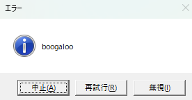

# Win-Dialog

An idiomatic Rust interface for the Windows [message box](https://learn.microsoft.com/en-us/windows/win32/api/winuser/nf-winuser-messageboxa) API.

## Motivation

One can simply use the [windows](https://crates.io/crates/windows) crate to invoke this api, but the api is a rather old-fashioned C-style API, so its rather unintuitive for a Rust developer without C programming experience to use. This create wraps the raw API with a familiar interface and provides more complete documentation about how to use it than the official crate documentation does.

## Message Box Appearance

A Windows message box looks like this:



You have the ability to make the following changes:

- Change the header (or display a default header)
- Change the body text
- Choose the available buttons from among a fixed set. You cannot edit button text
- Change the icon (or display no icon)

## Usage

```rust
use win_dialog::{style, Icon, WinDialog};

fn main() {
    let res =
        WinDialog::new("We encountered an error during installation. What would you like to do?")
            .with_style(style::AbortRetryIgnore)
            .with_icon(Icon::Hand)
            .show()
            .unwrap();
    println!("{res:?}");
}
```

## Possible Future Features

- Dialog timeouts
- Async interface
